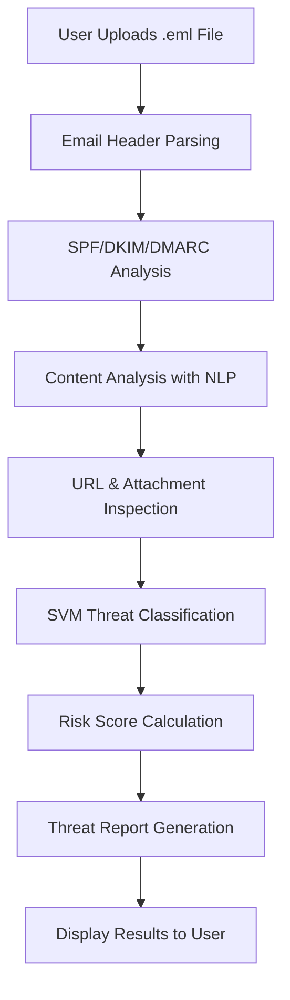

# Email Header Analysis Tool for Cyber Threat Detection

A comprehensive web-based framework utilizing header metadata analysis and Support Vector Machine (SVM) classification for detecting email threats, including phishing, malware, spoofing, and spam emails.

## 📑 Research Paper
This project is based on the research paper: **"A comparative analysis of machine learning models for email threat detection: A web-based framework utilizing header metadata and SVM classification"** by Rapelli Naga Sathvik et al., Narayana Engineering College, Nellore, Andhra Pradesh, India.

**Published Paper:** [Publication](https://www.taylorfrancis.com/chapters/edit/10.1201/9781003684589-65)

## 🚀 Overview

Traditional email security systems primarily focus on analyzing email subject lines and body content, often overlooking the critical metadata contained in email headers. This project addresses this gap by implementing a sophisticated email threat detection system that:

- Analyzes email header metadata, including IP addresses, routing information, and authentication details
- Employs machine learning algorithms (primarily SVM) for threat classification
- Provides a user-friendly web interface for .eml file analysis
- Generates comprehensive threat reports with risk assessments

## ✨ Key Features

### Core Functionality
- **Header Analysis**: Deep inspection of email headers, including SPF, DKIM, and DMARC authentication
- **Content Analysis**: Natural Language Processing (NLP) for body content examination
- **URL & Attachment Inspection**: Threat database checking and malware hash verification
- **Machine Learning Classification**: SVM-based threat detection with 99.10% accuracy
- **Automated Reporting**: Detailed threat assessment reports

### Security Enhancements
- **Multi-layered Detection**: Combines header analysis, content inspection, and attachment scanning
- **Authentication Verification**: SPF/DKIM/DMARC validation for sender authenticity
- **Advanced NLP**: Text classification and entity recognition for fraud detection
- **Real-time Processing**: Instant analysis and classification of uploaded email files

## 🏗️ System Architecture

The system follows a modular and scalable architecture with four main layers:

```
┌─────────────────────────────────────┐
│          User Interface Layer       │
│        (Bootstrap, HTML, CSS, JS)   │
├─────────────────────────────────────┤
│       Application Processing        │
│            Layer (Flask)            │
├─────────────────────────────────────┤
│        Machine Learning Layer       │
│             (SVM Model)             │
├─────────────────────────────────────┤
│         Database Layer              │
│           (SQLite)                  │
└─────────────────────────────────────┘
```

## 📁 Project Structure

```
Email-Header-Analysis-Tool-Cyber-Threat-Detection/
├── app.py                      # Main Flask application
├── requirements.txt            # Python dependencies
├── README.md                   # Project documentation
├── static/                     # Static files (CSS, JS, images)
│   ├── css/
│   ├── js/
│   └── images/
├── templates/                  # HTML templates
│   ├── index.html             # Main upload interface
│   ├── results.html           # Results display page
│   └── base.html              # Base template
├── models/                     # Machine learning models
│   ├── svm_model.pkl          # Trained SVM model
│   └── vectorizer.pkl         # Text vectorizer
├── utils/                      # Utility functions
│   ├── email_parser.py        # Email parsing utilities
│   ├── header_analyzer.py     # Header analysis functions
│   ├── nlp_processor.py       # NLP processing
│   └── threat_detector.py     # Threat detection logic
├── database/                   # Database files
│   └── threats.db             # SQLite database
└── uploads/                    # Temporary upload directory
```

## 🛠️ Installation and Setup

### Prerequisites
- Python 3.7 or higher
- pip (Python package manager)
- Git

### Step 1: Clone the Repository
```bash
git clone https://github.com/Nagasathvik/Email-Header-Analysis-Tool-Cyber-Threat-Detection.git
cd Email-Header-Analysis-Tool-Cyber-Threat-Detection
```

### Step 2: Create Virtual Environment (Recommended)
```bash
python -m venv venv

# On Windows
venv\Scripts\activate

# On macOS/Linux
source venv/bin/activate
```

### Step 3: Install Dependencies
```bash
pip install -r requirements.txt
```

### Step 4: Initialize Database
```bash
python -c "from utils.database import init_db; init_db()"
```

### Step 5: Run the Application
```bash
python app.py
```

The application will be available at `http://localhost:5000`

## 📋 Dependencies

```
Flask==2.3.3
scikit-learn==1.3.0
pandas==2.0.3
numpy==1.24.3
nltk==3.8.1
email-validator==2.0.0
beautifulsoup4==4.12.2
requests==2.31.0
```

*Note: sqlite3 is included with Python by default*

## 🔧 Usage

### Step 1: Access Web Interface
Navigate to `http://localhost:5000` in your web browser

### Step 2: Upload Email File
- Click on the upload area or drag and drop an .eml file
- Supported format: .eml (Email Message files)

### Step 3: Analysis Process
The system will automatically:
1. Parse email headers and extract metadata
2. Analyze content using NLP techniques
3. Check URLs and attachments against threat databases
4. Classify the email using the trained SVM model
5. Generate a comprehensive threat report

### Step 4: View Results
- **Risk Score**: Overall threat assessment (0-100%)
- **Classification**: Safe, Suspicious, or Malicious
- **Detailed Analysis**: Header anomalies, content flags, and recommendations
- **Threat Indicators**: Specific threats detected (phishing, malware, spoofing)

## 🎯 Workflow Overview



## 📊 Performance Metrics

Based on extensive testing with over 10,000 real-world emails, our system achieved:

| Metric | Value |
|--------|-------|
| **Accuracy** | 99.10% |
| **Precision** | 98.60% |
| **Recall** | 94.63% |
| **F1-Score** | 96.57% |

### Model Comparison Results

| Model | Accuracy | Precision | Recall | F1-Score |
|-------|----------|-----------|--------|----------|
| **Support Vector Machine (SVM)** | **99.10%** | **98.60%** | **94.63%** | **96.57%** |
| Random Forest (RF) | 97.31% | 95.42% | 91.86% | 93.60% |
| K-Nearest Neighbors (KNN) | 94.23% | 91.78% | 89.02% | 90.39% |
| Logistic Regression (LR) | 92.85% | 89.64% | 85.31% | 87.42% |

### Real-World Testing Results

| Email Category | Total Samples | Correctly Classified | Accuracy |
|----------------|---------------|---------------------|----------|
| **Legitimate Emails** | 4,500 | 4,472 | 99.38% |
| **Spam Emails** | 2,500 | 2,458 | 98.32% |
| **Phishing Emails** | 2,000 | 1,926 | 96.30% |
| **Malware-Infected Emails** | 1,000 | 953 | 95.30% |

## 🔍 Technical Details

### Email Header Analysis
- **Authentication Checks**: SPF, DKIM, DMARC validation
- **IP Analysis**: Sender IP reputation and geolocation
- **Routing Path**: Complete email delivery path inspection
- **Timestamp Verification**: Consistency checks across headers

### Machine Learning Features
- **Feature Extraction**: 50+ features from headers and content
- **Text Vectorization**: TF-IDF and n-gram analysis
- **Model Training**: Supervised learning with labeled dataset
- **Cross-Validation**: 5-fold cross-validation for model robustness

### NLP Processing
- **Tokenization**: Text preprocessing and normalization
- **Named Entity Recognition (NER)**: Detection of suspicious entities
- **Sentiment Analysis**: Emotional tone analysis
- **Pattern Matching**: Financial fraud and phishing phrase detection

## 🖼️ Screenshots

### Main Upload Interface

Web interface for uploading .eml files

### Report Loading Interface

Web interface for Report Loading

### Threat Report Generation

Detailed threat analysis report after .eml file examination

### Spam Probability Analysis

Spam probability analysis results

## 🚀 Future Enhancements

### Planned Features
- **Real-time Threat Intelligence**: Integration with VirusTotal, PhishTank
- **Advanced Deep Learning**: BERT model integration for context analysis
- **Behavioral Analysis**: User behavior pattern recognition
- **API Development**: RESTful API for third-party integrations
- **Mobile Application**: Cross-platform mobile app
- **Enterprise Integration**: SIEM and security platform connectors

### Advanced Capabilities
- **Zero-day Threat Detection**: Advanced persistent threat (APT) identification
- **Automated URL Sandboxing**: Dynamic malware analysis
- **Multi-language Support**: International phishing detection
- **Cloud Deployment**: Scalable cloud-based architecture

## 🤝 Contributing

We welcome contributions from the community! Here's how you can help:

### Getting Started
1. Fork the repository
2. Create a feature branch (`git checkout -b feature/AmazingFeature`)
3. Make your changes
4. Add tests for new functionality
5. Commit your changes (`git commit -m 'Add some AmazingFeature'`)
6. Push to the branch (`git push origin feature/AmazingFeature`)
7. Open a Pull Request

### Development Guidelines
- Follow PEP 8 style guidelines
- Write comprehensive tests
- Update documentation
- Ensure backward compatibility

## 📄 License

This project is licensed under the MIT License - see the [LICENSE](https://github.com/Nagasathvik/Email-Header-Analysis-Tool-Cyber-Threat-Detection/blob/main/EmailAnalyzer/LICENSE) file for details.

## 👥 Authors and Acknowledgments

### Research Team
- **P. Penchalaiah** - Professor, Department of CSE, Narayana Engineering College
- **Rapelli Naga Sathvik** - UG Scholar, Department of CSE
- **K. V. H. Karthik** - UG Scholar, Department of CSE
- **M. Jagadheesh** - UG Scholar, Department of CSE
- **P. Sai Gowrish** - UG Scholar, Department of CSE
- **V. Madhava Reddy** - UG Scholar, Department of CSE

### Institution
Narayana Engineering College, Nellore, Andhra Pradesh, India

### Special Thanks
- Research supervisors and faculty members
- Beta testers and feedback providers
- Open-source community contributors

## 🐛 Bug Reports and Feature Requests

Please use GitHub Issues to report bugs or request features:
- [Report a Bug](https://github.com/Nagasathvik/Email-Header-Analysis-Tool-Cyber-Threat-Detection/issues/new?template=bug_report.md)
- [Request a Feature](https://github.com/Nagasathvik/Email-Header-Analysis-Tool-Cyber-Threat-Detection/issues/new?template=feature_request.md)

## 📞 Contact

- **Email**: nagasathvikrapelli@gmail.com
- **GitHub**: [@Nagasathvik](https://github.com/Nagasathvik)
- **LinkedIn**: [Naga Sathvik Rapelli](https://www.linkedin.com/in/naga-sathvik-rapelli/)

## 🔗 Related Research

For more information about the research methodology and detailed analysis, please refer to our published paper: [Publication](https://www.taylorfrancis.com/chapters/edit/10.1201/9781003684589-65)

**Citation:**
```
Penchalaiah, P., Sathvik, R. N., Karthik, K. V. H., Jagadheesh, M., Gowrish, P. S., & Reddy, V. M. (2025). 
A comparative analysis of machine learning models for email threat detection: A web-based framework utilizing header metadata and SVM classification. 
Advancing Innovation through AI and Machine Learning Algorithms, 401-405.
```

---

⭐ **If you find this project useful, please consider giving it a star on GitHub!**

---

*Last updated: September 2025*
